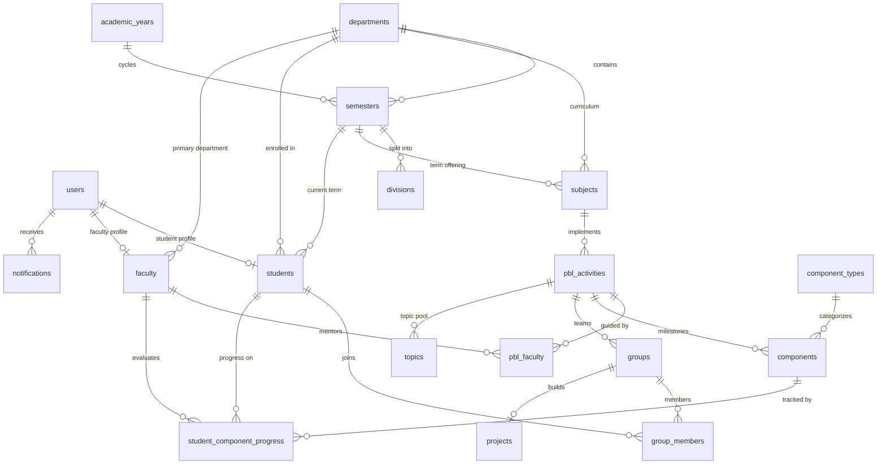
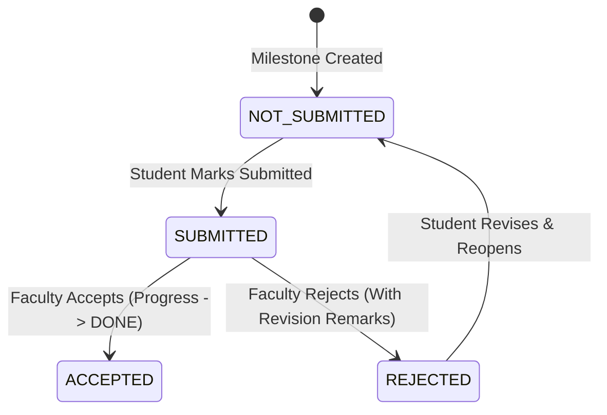

# PBL Central — Database Architecture & Schema Specification

This document provides a comprehensive technical overview of the **PBL Central** database architecture, entity relationships, schema tables, evaluation lifecycle, business constraints, and demo seed data. It is structured for academic viva presentation, curriculum auditing, and technical evaluation.

---

## 1. Architecture & Technology Stack

- **Total Tables**: **18 Tables** (Streamlined and simplified from 23, eliminating over-engineered audit/junction tables).
- **ORM**: [SQLAlchemy 2.0](https://www.sqlalchemy.org/) (declarative mapping with type-safe schema definitions).
- **Primary Database Engine**: SQLite (embedded, local development & demo) / PostgreSQL (production & containerized deployments).
- **Database Migrations / Schema Initialization**: Declarative table creation via `init_db()` and programmatic seeding via `app.seed.seed_database()`.
- **Normalization Level**: Third Normal Form (3NF) with relational integrity, foreign key cascading, and composite unique constraints.
- **Evaluation Paradigm**: Replaced numeric grading with a streamlined **Accept / Reject** evaluation decision with faculty feedback stored directly on each student's progress record.

---

## 2. Streamlined Architecture Summary (18 Tables)

| Domain | Table Name | Purpose |
|---|---|---|
| **Identity & Access** | `users` | Core auth account credentials & roles (`ADMIN`, `FACULTY`, `STUDENT`) |
| | `students` | Academic profile (enrollment number, semester, division, department) |
| | `faculty` | Faculty profile (faculty code, department, contact info) |
| **Academic Hierarchy** | `departments` | Engineering branches (CE, IT, ME, CL, EC) |
| | `academic_years` | Academic calendar cycles (e.g., 2026–27) |
| | `semesters` | Semester terms (e.g., Semester 3, 5, 7) directly linked to department |
| | `divisions` | Cohort divisions (e.g., A, B) |
| | `subjects` | Course curriculum catalog (e.g., Computer Networks, DBMS) |
| **PBL & Milestones** | `pbl_activities` | Project-based learning course activities & settings |
| | `pbl_faculty` | Mentors and guides assigned to a PBL activity |
| | `component_types` | Deliverable taxonomy (Mini Project, Presentation, Case Study, etc.) |
| | `components` | Milestones, deadlines, external Google Form & Classroom links |
| **Teamwork & Projects** | `groups` | Student collaborative teams within a PBL activity |
| | `group_members` | Group membership junction table |
| | `projects` | Team project title, topic, external repository URL, and faculty mentor |
| **Topics** | `topics` | Topic pool and student-proposed topics with approval status |
| **Progress & Evaluation** | `student_component_progress` | Student progress, submission lifecycle, Accept/Reject decision & feedback |
| **Communication** | `notifications` | In-app alerts, deadline reminders, and faculty evaluation updates |

---

## 3. Entity-Relationship (ER) Diagram

---

## 4. Key Simplifications Made

1. **`programs` removed**:
   Semesters directly link to Departments (`department_id`). In a single college setup, having a separate program table between department and semester added unnecessary joins without distinct utility.
2. **`faculty_departments` removed**:
   Faculty members have a direct foreign key `faculty.department_id` to their primary department, avoiding an extra junction table.
3. **`component_assignments` removed**:
   Milestones/components created under a PBL activity automatically apply to all students enrolled in that activity's department and semester.
4. **`topic_histories` removed**:
   Topic approval status (`APPROVED`, `REJECTED`, `PENDING`) and rejection reasons are tracked directly on `topics`.
5. **`faculty_reviews` merged**:
   Numeric marks (out of 25) have been completely removed. Evaluations are now clean **Accept / Reject** decisions with faculty remarks stored directly on `student_component_progress`:
   - `submission_state`: `NOT_SUBMITTED` -> `SUBMITTED` -> `ACCEPTED` or `REJECTED`
   - `faculty_feedback`: Detailed qualitative feedback and guidance
   - `reviewed_by_faculty_id`: Evaluator faculty guide ID
   - `reviewed_at`: Evaluation timestamp

---

## 5. Detailed Schema Tables

### 5.1 Identity & Access

#### `users`
| Column | Type | Constraints | Description |
|---|---|---|---|
| `id` | `INTEGER` | PK, Auto | Unique account identifier |
| `username` | `VARCHAR(100)` | Unique, Indexed, Not Null | Unique login ID (enrollment number for students, short code for faculty/admin) |
| `password_hash` | `VARCHAR(255)` | Not Null | Bcrypt salted hash |
| `role` | `ENUM` | Not Null | `ADMIN`, `FACULTY`, `STUDENT` |
| `is_active` | `BOOLEAN` | Default `True` | Account activation state |
| `created_at` | `DATETIME` | Not Null | Timestamp of registration |
| `updated_at` | `DATETIME` | Not Null | Timestamp of last modification |

#### `students`
| Column | Type | Constraints | Description |
|---|---|---|---|
| `id` | `INTEGER` | PK, Auto | Student identifier |
| `user_id` | `INTEGER` | FK(`users.id`), Unique, Not Null | Linked user account |
| `enrollment_number` | `VARCHAR(50)` | Unique, Indexed, Not Null | Institutional student ID (e.g. `230101`) |
| `name` | `VARCHAR(150)` | Not Null | Student full legal name |
| `email` | `VARCHAR(150)` | Nullable | Contact email |
| `phone_number` | `VARCHAR(30)` | Nullable | Contact phone |
| `department_id` | `INTEGER` | FK(`departments.id`), Not Null | Enrolled department |
| `semester_id` | `INTEGER` | FK(`semesters.id`), Not Null | Current semester |
| `division_id` | `INTEGER` | FK(`divisions.id`), Nullable | Assigned class division |
| `created_at`, `updated_at` | `DATETIME` | Not Null | Audit timestamps |

#### `faculty`
| Column | Type | Constraints | Description |
|---|---|---|---|
| `id` | `INTEGER` | PK, Auto | Faculty identifier |
| `user_id` | `INTEGER` | FK(`users.id`), Unique, Not Null | Linked user account |
| `faculty_code` | `VARCHAR(50)` | Unique, Indexed, Not Null | Faculty staff code (e.g. `FAC-CE-01`) |
| `name` | `VARCHAR(150)` | Not Null | Professor full name |
| `email` | `VARCHAR(150)` | Nullable | Official institutional email |
| `phone` | `VARCHAR(30)` | Nullable | Contact number |
| `department_id` | `INTEGER` | FK(`departments.id`), Nullable | Primary engineering department |
| `created_at`, `updated_at` | `DATETIME` | Not Null | Audit timestamps |

---

### 5.2 Academic Hierarchy

#### `departments`
| Column | Type | Constraints | Description |
|---|---|---|---|
| `id` | `INTEGER` | PK, Auto | Department ID |
| `name` | `VARCHAR(150)` | Not Null | Full department name (e.g. Computer Engineering) |
| `code` | `VARCHAR(20)` | Unique, Indexed, Not Null | Short code (e.g. `CE`, `IT`, `ME`) |
| `description` | `TEXT` | Nullable | Description |
| `is_active` | `BOOLEAN` | Default `True` | Department active status |

#### `academic_years`
| Column | Type | Constraints | Description |
|---|---|---|---|
| `id` | `INTEGER` | PK, Auto | Academic Year ID |
| `name` | `VARCHAR(50)` | Not Null | Cycle name (e.g. `2026–27`) |
| `start_date` | `DATE` | Not Null | Term start |
| `end_date` | `DATE` | Not Null | Term finish |
| `is_current` | `BOOLEAN` | Default `False` | Currently active academic year flag |

#### `semesters`
| Column | Type | Constraints | Description |
|---|---|---|---|
| `id` | `INTEGER` | PK, Auto | Semester ID |
| `name` | `VARCHAR(50)` | Not Null | Display name (e.g. `Semester 5`) |
| `number` | `INTEGER` | Not Null | Semester digit (1 through 8) |
| `academic_year_id` | `INTEGER` | FK(`academic_years.id`), Not Null | Associated academic cycle |
| `department_id` | `INTEGER` | FK(`departments.id`), Not Null | Engineering department |

#### `divisions`
| Column | Type | Constraints | Description |
|---|---|---|---|
| `id` | `INTEGER` | PK, Auto | Division ID |
| `name` | `VARCHAR(20)` | Not Null | Section name (e.g. `A`, `B`) |
| `semester_id` | `INTEGER` | FK(`semesters.id`), Not Null | Parent semester |
| `department_id` | `INTEGER` | FK(`departments.id`), Not Null | Department |

#### `subjects`
| Column | Type | Constraints | Description |
|---|---|---|---|
| `id` | `INTEGER` | PK, Auto | Subject ID |
| `name` | `VARCHAR(150)` | Not Null | Subject course name |
| `subject_code` | `VARCHAR(30)` | Unique, Indexed, Not Null | Course syllabus code (e.g. `CS501`) |
| `semester_id` | `INTEGER` | FK(`semesters.id`), Not Null | Curriculum semester |
| `department_id` | `INTEGER` | FK(`departments.id`), Not Null | Academic department |
| `description` | `TEXT` | Nullable | Syllabus description |
| `is_active` | `BOOLEAN` | Default `True` | Active status |

---

### 5.3 PBL & Milestone Activities

#### `pbl_activities`
| Column | Type | Constraints | Description |
|---|---|---|---|
| `id` | `INTEGER` | PK, Auto | PBL Activity ID |
| `title` | `VARCHAR(200)` | Not Null | Course project title |
| `description` | `TEXT` | Nullable | Activity goals & requirements |
| `subject_id` | `INTEGER` | FK(`subjects.id`), Not Null | Associated subject |
| `academic_year_id` | `INTEGER` | FK(`academic_years.id`), Not Null | Academic year |
| `semester_id` | `INTEGER` | FK(`semesters.id`), Not Null | Semester batch |
| `department_id` | `INTEGER` | FK(`departments.id`), Not Null | Department |
| `start_date` | `DATE` | Not Null | Project launch date |
| `end_date` | `DATE` | Not Null | Final submission deadline |
| `status` | `ENUM` | Default `ACTIVE` | `DRAFT`, `ACTIVE`, `COMPLETED`, `ARCHIVED` |
| `topic_mode` | `ENUM` | Default `STUDENT_PROPOSED` | `FACULTY_ASSIGNED`, `STUDENT_LIST`, `STUDENT_PROPOSED`, `NO_TOPIC` |
| `allow_student_groups` | `BOOLEAN` | Default `True` | Whether groups are enabled |
| `require_group_approval`| `BOOLEAN` | Default `False` | Whether faculty must approve groups |
| `created_by` | `INTEGER` | FK(`users.id`), Nullable | Activity creator |

#### `pbl_faculty`
| Column | Type | Constraints | Description |
|---|---|---|---|
| `id` | `INTEGER` | PK, Auto | Junction ID |
| `pbl_activity_id` | `INTEGER` | FK(`pbl_activities.id`), Not Null | Associated PBL activity |
| `faculty_id` | `INTEGER` | FK(`faculty.id`), Not Null | Assigned faculty mentor |
| `role_description` | `VARCHAR(100)` | Default `"Faculty Guide"` | Role designation |

#### `component_types`
| Column | Type | Constraints | Description |
|---|---|---|---|
| `id` | `INTEGER` | PK, Auto | Type ID |
| `name` | `VARCHAR(100)` | Unique, Not Null | Milestone deliverable category name |
| `description` | `TEXT` | Nullable | Explanatory description |
| `icon` | `VARCHAR(50)` | Default `"FileText"` | Lucide icon identifier |
| `is_active` | `BOOLEAN` | Default `True` | Active status |

#### `components`
| Column | Type | Constraints | Description |
|---|---|---|---|
| `id` | `INTEGER` | PK, Auto | Component milestone ID |
| `pbl_activity_id` | `INTEGER` | FK(`pbl_activities.id`), Not Null | Parent PBL activity |
| `component_type_id` | `INTEGER` | FK(`component_types.id`), Not Null | Deliverable category |
| `title` | `VARCHAR(200)` | Not Null | Component title (e.g. System Design Architecture) |
| `description` | `TEXT` | Nullable | Deliverable guidelines |
| `deadline` | `DATETIME` | Not Null | Due date and time |
| `submission_required` | `BOOLEAN` | Default `True` | Requires deliverable submission |
| `external_submission_url` | `VARCHAR(500)` | Nullable | Direct submission link (e.g. Google Form) |
| `external_classroom_url` | `VARCHAR(500)` | Nullable | Google Classroom link |
| `external_resource_url` | `VARCHAR(500)` | Nullable | Supplementary reading materials |
| `is_group` | `BOOLEAN` | Default `False` | Group milestone flag |
| `archived_at` | `DATETIME` | Nullable | Soft-delete timestamp to preserve academic history |

---

### 5.4 Teams, Projects & Topics

#### `groups`
| Column | Type | Constraints | Description |
|---|---|---|---|
| `id` | `INTEGER` | PK, Auto | Group ID |
| `pbl_activity_id` | `INTEGER` | FK(`pbl_activities.id`), Not Null | Parent activity |
| `component_id` | `INTEGER` | FK(`components.id`), Nullable | Optional milestone binding |
| `group_name` | `VARCHAR(100)` | Not Null | Team name (e.g. `Group Alpha`) |
| `group_code` | `VARCHAR(50)` | Nullable | Code identifier (e.g. `GRP-CN-01`) |
| `created_by` | `INTEGER` | FK(`users.id`), Nullable | Creator account ID |

#### `group_members`
| Column | Type | Constraints | Description |
|---|---|---|---|
| `id` | `INTEGER` | PK, Auto | Membership ID |
| `group_id` | `INTEGER` | FK(`groups.id`), Not Null | Team ID |
| `student_id` | `INTEGER` | FK(`students.id`), Not Null | Member student |
| `joined_at` | `DATETIME` | Not Null | Join timestamp |

#### `projects`
| Column | Type | Constraints | Description |
|---|---|---|---|
| `id` | `INTEGER` | PK, Auto | Project ID |
| `group_id` | `INTEGER` | FK(`groups.id`), Unique, Nullable | Assigned group (1:1 relationship) |
| `pbl_activity_id` | `INTEGER` | FK(`pbl_activities.id`), Not Null | Parent PBL activity |
| `title` | `VARCHAR(255)` | Not Null | Project title |
| `topic` | `VARCHAR(255)` | Nullable | Research/domain topic |
| `description` | `TEXT` | Nullable | Technical scope summary |
| `guide_faculty_id` | `INTEGER` | FK(`faculty.id`), Nullable | Faculty mentor |
| `status` | `VARCHAR(50)` | Default `"In Progress"` | Working status |
| `external_url` | `VARCHAR(500)` | Nullable | GitHub/GitLab repository URL |

#### `topics`
| Column | Type | Constraints | Description |
|---|---|---|---|
| `id` | `INTEGER` | PK, Auto | Topic ID |
| `pbl_activity_id` | `INTEGER` | FK(`pbl_activities.id`), Not Null | Parent PBL activity |
| `title` | `VARCHAR(255)` | Not Null | Topic proposal title |
| `description` | `TEXT` | Nullable | Proposal details |
| `mode` | `ENUM` | Not Null | `FACULTY_ASSIGNED`, `STUDENT_LIST`, `STUDENT_PROPOSED`, `NO_TOPIC` |
| `status` | `ENUM` | Default `APPROVED` | `APPROVED`, `REJECTED`, `PENDING` |
| `proposed_by_student_id` | `INTEGER` | FK(`students.id`), Nullable | Student author (if proposed) |
| `assigned_to_group_id` | `INTEGER` | FK(`groups.id`), Nullable | Assigned team |
| `assigned_to_student_id` | `INTEGER` | FK(`students.id`), Nullable | Assigned individual |
| `rejection_reason` | `TEXT` | Nullable | Feedback reason if rejected |

---

### 5.5 Progress, Evaluations & Notifications

#### `student_component_progress`
| Column | Type | Constraints | Description |
|---|---|---|---|
| `id` | `INTEGER` | PK, Auto | Progress ID |
| `student_id` | `INTEGER` | FK(`students.id`), Not Null | Student |
| `component_id` | `INTEGER` | FK(`components.id`), Not Null | Component milestone |
| `progress_state` | `ENUM` | Default `TODO` | Student working state: `TODO`, `IN_PROGRESS`, `DONE` |
| `submission_state` | `ENUM` | Default `NOT_SUBMITTED` | Submission lifecycle: `NOT_SUBMITTED`, `SUBMITTED`, `ACCEPTED`, `REJECTED` |
| `submitted_at` | `DATETIME` | Nullable | Submission timestamp |
| `faculty_feedback` | `TEXT` | Nullable | Qualitative faculty feedback / revision notes |
| `reviewed_by_faculty_id` | `INTEGER` | FK(`faculty.id`), Nullable | Evaluating faculty guide |
| `reviewed_at` | `DATETIME` | Nullable | Timestamp of evaluation |

> **Unique Constraint:** `UniqueConstraint("student_id", "component_id", name="uq_student_component")` guarantees exactly one progress row per student per deliverable.

#### `notifications`
| Column | Type | Constraints | Description |
|---|---|---|---|
| `id` | `INTEGER` | PK, Auto | Notification ID |
| `user_id` | `INTEGER` | FK(`users.id`), Not Null | Recipient user |
| `title` | `VARCHAR(200)` | Not Null | Brief alert title |
| `message` | `TEXT` | Not Null | Detailed message body |
| `link` | `VARCHAR(300)` | Nullable | Navigation destination in UI |
| `is_read` | `BOOLEAN` | Default `False` | Read receipt |
| `created_at` | `DATETIME` | Not Null | Timestamp of generation |

---

## 6. Evaluation State Machine

1. **Submission**: Student completes deliverable work and clicks **Mark as Submitted**.
2. **Review**: Faculty opens the submission in the evaluation console.
3. **Decision**:
   - **Accept**: Sets `submission_state = ACCEPTED`, updates progress to `DONE`, logs feedback.
   - **Reject**: Sets `submission_state = REJECTED`, notifies student with revision requirements.

---

## 7. Demo Seed Data Verification

The demo database is pre-populated with realistic academic data:
- **1 Department**: Computer Engineering (`CE`)
- **1 Academic Year**: 2026–27 (`ay_current`)
- **3 Semesters**: Semester 3, Semester 5, Semester 7
- **2 Divisions**: Division A and Division B
- **8 Realistic Courses**: Computer Networks (`CS501`), DBMS (`CS502`), Operating Systems (`CS503`), Software Engineering (`CS504`), etc.
- **7 User Accounts**:
  - Admin (`admin` / `Admin@123`)
  - 2 Faculty (`faculty01`, `faculty02` / `Faculty@123`)
  - 4 Students (`230101` through `230104` / `Student@123`)
- **Evaluations & Feedback**:
  - Student `230101` (Rahul Patel) has accepted submissions with faculty feedback on Database Certification and Software Engineering Case Study, and an active submission pending review on Computer Networks Presentation.
