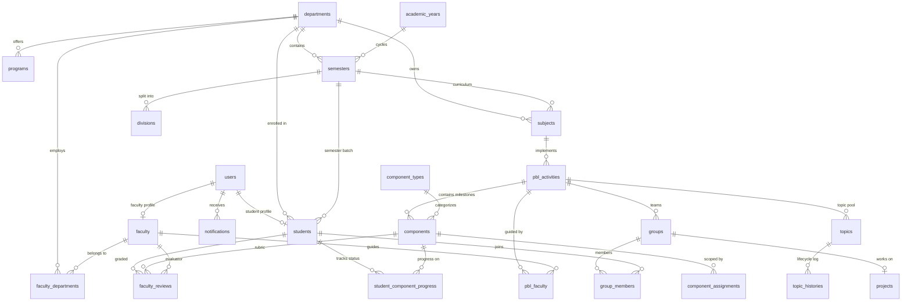

# PBL Central — Database Architecture & Schema Specification

This document provides a comprehensive technical overview of the **PBL Central** database architecture, entity relationships, schema tables, state machines, business constraints, and demo seed data. It is structured for academic viva presentation, curriculum auditing, and technical evaluation.

---

## 1. Architecture & Technology Stack

- **ORM**: [SQLAlchemy 2.0](https://www.sqlalchemy.org/) (declarative mapping with type-safe schema definitions)
- **Primary Database Engine**: SQLite (embedded, local development & demo) / PostgreSQL (production & containerized deployments)
- **Database Migrations / Schema Initialization**: Automatic declarative table creation via `init_db()` and programmatic seeding via `app.seed.seed_database()`
- **Normalization Level**: Third Normal Form (3NF) with relational integrity, foreign key cascading, and composite unique constraints
- **Security & Privacy Boundary**: Role-segregated models where confidential faculty grading (`internal_marks`) is decoupled into a dedicated table (`faculty_reviews`) never serialized to student endpoints

---

## 2. Entity-Relationship (ER) Diagram



---

## 3. Database Schema Tables

The database is divided into 5 logical clusters:
1. **User Authentication & Role Profiles**
2. **Academic Hierarchy & Institution Registries**
3. **PBL Activities & Milestone Components**
4. **Student Groups & Project Topics**
5. **Progress Tracking, Confidential Grading & Notifications**

---

### Cluster 1: User Authentication & Role Profiles

#### `users`
Central identity authentication table. Every person in the system has one user record.

| Column | Type | Constraints | Description |
|---|---|---|---|
| `id` | `INTEGER` | `PRIMARY KEY`, Auto-inc | Unique user ID |
| `username` | `VARCHAR(100)` | `UNIQUE`, `NOT NULL`, Indexed | Enrollment no. (students) or handle (faculty/admin) |
| `password_hash` | `VARCHAR(255)` | `NOT NULL` | Argon2 / bcrypt hashed password string |
| `role` | `VARCHAR(20)` | `NOT NULL` | Enum: `STUDENT`, `FACULTY`, `ADMIN` |
| `is_active` | `BOOLEAN` | `NOT NULL`, Default: `TRUE` | Account active state |
| `created_at` | `DATETIME` | Default: `UTC NOW` | Timestamp of creation |
| `updated_at` | `DATETIME` | Auto-update | Timestamp of last modification |

#### `students`
Academic student profile linked 1:1 with `users`.

| Column | Type | Constraints | Description |
|---|---|---|---|
| `id` | `INTEGER` | `PRIMARY KEY`, Auto-inc | Student ID |
| `user_id` | `INTEGER` | `UNIQUE`, `NOT NULL`, FK `users.id` (CASCADE) | Auth user linkage |
| `enrollment_number` | `VARCHAR(50)` | `UNIQUE`, `NOT NULL`, Indexed | College enrollment / roll number (e.g. `230101`) |
| `name` | `VARCHAR(150)` | `NOT NULL` | Full student name |
| `email` | `VARCHAR(150)` | Nullable | Contact email |
| `phone_number` | `VARCHAR(30)` | Nullable | Contact phone number |
| `department_id` | `INTEGER` | `NOT NULL`, FK `departments.id` | Department branch |
| `semester_id` | `INTEGER` | `NOT NULL`, FK `semesters.id` | Current academic semester |
| `division_id` | `INTEGER` | `NOT NULL`, FK `divisions.id` | Current class division |

#### `faculty`
Faculty coordinator and evaluator profile linked 1:1 with `users`.

| Column | Type | Constraints | Description |
|---|---|---|---|
| `id` | `INTEGER` | `PRIMARY KEY`, Auto-inc | Faculty ID |
| `user_id` | `INTEGER` | `UNIQUE`, `NOT NULL`, FK `users.id` (CASCADE) | Auth user linkage |
| `faculty_code` | `VARCHAR(50)` | `UNIQUE`, Nullable, Indexed | Institutional faculty code (e.g. `FAC-CE-01`) |
| `name` | `VARCHAR(150)` | `NOT NULL` | Full name with title (e.g. `Dr. Rajesh Sharma`) |
| `email` | `VARCHAR(150)` | Nullable | Official institutional email |
| `phone` | `VARCHAR(30)` | Nullable | Contact extension / phone |

#### `faculty_departments`
Junction table supporting faculty teaching across multiple academic departments.

| Column | Type | Constraints | Description |
|---|---|---|---|
| `id` | `INTEGER` | `PRIMARY KEY`, Auto-inc | Record ID |
| `faculty_id` | `INTEGER` | `NOT NULL`, FK `faculty.id` (CASCADE) | Faculty reference |
| `department_id` | `INTEGER` | `NOT NULL`, FK `departments.id` (CASCADE) | Department reference |

---

### Cluster 2: Academic Hierarchy & Institution Registries

#### `departments`
Academic departments (e.g., Computer Engineering, Information Technology).

| Column | Type | Constraints | Description |
|---|---|---|---|
| `id` | `INTEGER` | `PRIMARY KEY`, Auto-inc | Department ID |
| `name` | `VARCHAR(150)` | `UNIQUE`, `NOT NULL` | Department name |
| `code` | `VARCHAR(20)` | `UNIQUE`, `NOT NULL`, Indexed | Short code (`CE`, `IT`, `ME`, `EC`) |
| `description` | `TEXT` | Nullable | Department overview |
| `is_active` | `BOOLEAN` | `NOT NULL`, Default: `TRUE` | Status flag |

#### `programs`
Degree programs offered by departments (e.g., B.Tech, M.Tech).

| Column | Type | Constraints | Description |
|---|---|---|---|
| `id` | `INTEGER` | `PRIMARY KEY`, Auto-inc | Program ID |
| `name` | `VARCHAR(150)` | `NOT NULL` | Degree program title |
| `code` | `VARCHAR(20)` | `NOT NULL`, Indexed | Program code (`BTECH-CE`) |
| `department_id` | `INTEGER` | `NOT NULL`, FK `departments.id` (CASCADE) | Offering department |

#### `academic_years`
Calendar academic sessions for historical archiving.

| Column | Type | Constraints | Description |
|---|---|---|---|
| `id` | `INTEGER` | `PRIMARY KEY`, Auto-inc | Academic year ID |
| `name` | `VARCHAR(50)` | `UNIQUE`, `NOT NULL` | Academic session label (`2026–27`) |
| `start_date` | `DATE` | `NOT NULL` | Cycle start date |
| `end_date` | `DATE` | `NOT NULL` | Cycle end date |
| `is_current` | `BOOLEAN` | `NOT NULL`, Default: `FALSE` | Active cycle indicator |

#### `semesters`
Specific semester terms under an academic year.

| Column | Type | Constraints | Description |
|---|---|---|---|
| `id` | `INTEGER` | `PRIMARY KEY`, Auto-inc | Semester ID |
| `name` | `VARCHAR(50)` | `NOT NULL` | Display name (`Semester 5`) |
| `number` | `INTEGER` | `NOT NULL` | Numeric index (`5`) |
| `academic_year_id` | `INTEGER` | `NOT NULL`, FK `academic_years.id` | Academic year linkage |
| `program_id` | `INTEGER` | Nullable, FK `programs.id` | Program linkage |
| `department_id` | `INTEGER` | `NOT NULL`, FK `departments.id` | Department linkage |

#### `divisions`
Classroom divisions (batches) within a semester.

| Column | Type | Constraints | Description |
|---|---|---|---|
| `id` | `INTEGER` | `PRIMARY KEY`, Auto-inc | Division ID |
| `name` | `VARCHAR(20)` | `NOT NULL` | Division label (`A`, `B`) |
| `semester_id` | `INTEGER` | `NOT NULL`, FK `semesters.id` (CASCADE) | Semester linkage |
| `department_id` | `INTEGER` | `NOT NULL`, FK `departments.id` | Department linkage |

#### `subjects`
Curriculum courses mapped to semesters.

| Column | Type | Constraints | Description |
|---|---|---|---|
| `id` | `INTEGER` | `PRIMARY KEY`, Auto-inc | Subject ID |
| `name` | `VARCHAR(150)` | `NOT NULL` | Course title (`Computer Networks`) |
| `subject_code` | `VARCHAR(30)` | `UNIQUE`, `NOT NULL`, Indexed | Course code (`CS501`) |
| `semester_id` | `INTEGER` | `NOT NULL`, FK `semesters.id` | Semester curriculum assignment |
| `department_id` | `INTEGER` | `NOT NULL`, FK `departments.id` | Department ownership |
| `description` | `TEXT` | Nullable | Course syllabus overview |
| `is_active` | `BOOLEAN` | `NOT NULL`, Default: `TRUE` | Active course flag |

---

### Cluster 3: PBL Activities & Milestone Components

#### `pbl_activities`
The core Problem-Based Learning curriculum project container.

| Column | Type | Constraints | Description |
|---|---|---|---|
| `id` | `INTEGER` | `PRIMARY KEY`, Auto-inc | PBL Activity ID |
| `title` | `VARCHAR(200)` | `NOT NULL` | Project activity title |
| `description` | `TEXT` | Nullable | Academic instructions and objectives |
| `subject_id` | `INTEGER` | `NOT NULL`, FK `subjects.id` | Linked course subject |
| `academic_year_id` | `INTEGER` | `NOT NULL`, FK `academic_years.id` | Academic cycle |
| `semester_id` | `INTEGER` | `NOT NULL`, FK `semesters.id` | Semester cohort |
| `department_id` | `INTEGER` | `NOT NULL`, FK `departments.id` | Department branch |
| `start_date` | `DATE` | `NOT NULL` | Project launch date |
| `end_date` | `DATE` | `NOT NULL` | Final submission deadline |
| `status` | `VARCHAR(20)` | `NOT NULL`, Default: `ACTIVE` | Enum: `DRAFT`, `ACTIVE`, `COMPLETED`, `ARCHIVED` |
| `topic_mode` | `VARCHAR(30)` | `NOT NULL`, Default: `STUDENT_PROPOSED` | Enum: `FACULTY_ASSIGNED`, `STUDENT_LIST`, `STUDENT_PROPOSED`, `NO_TOPIC` |
| `allow_student_groups`| `BOOLEAN` | `NOT NULL`, Default: `TRUE` | Group collaboration allowed |
| `require_group_approval`| `BOOLEAN` | `NOT NULL`, Default: `FALSE` | Require faculty approval for groups |
| `created_by` | `INTEGER` | Nullable, FK `users.id` | Creator faculty/admin ID |
| `archived_at` | `DATETIME` | Nullable | Archival timestamp |

> **Draft vs. Active Mode:** When `status = 'DRAFT'`, the activity and its milestones are hidden from students. Faculty can safely create, reorder, or edit deliverables without broadcasting notifications. Setting `status = 'ACTIVE'` publishes the activity and notifies enrolled students.

#### `pbl_faculty`
Junction table linking faculty guides and evaluators to specific PBL activities.

| Column | Type | Constraints | Description |
|---|---|---|---|
| `id` | `INTEGER` | `PRIMARY KEY`, Auto-inc | Record ID |
| `pbl_activity_id` | `INTEGER` | `NOT NULL`, FK `pbl_activities.id` (CASCADE) | PBL activity |
| `faculty_id` | `INTEGER` | `NOT NULL`, FK `faculty.id` (CASCADE) | Faculty member |
| `role_description` | `VARCHAR(100)`| Default: `'Faculty Guide'` | Role description (`Lead Coordinator`, `Lab Evaluator`) |

#### `component_types`
Standardized milestone deliverable categories recognized by the university.

| Column | Type | Constraints | Description |
|---|---|---|---|
| `id` | `INTEGER` | `PRIMARY KEY`, Auto-inc | Type ID |
| `name` | `VARCHAR(100)` | `UNIQUE`, `NOT NULL` | Category name (`PPT`, `Report`, `Poster`, `Experiment`, `Mini Project`, `Certification Course`) |
| `description` | `TEXT` | Nullable | Deliverable description |
| `icon` | `VARCHAR(50)` | Default: `'FileText'` | Frontend Lucide icon identifier |
| `is_active` | `BOOLEAN` | Default: `TRUE` | Active flag |

#### `components`
Individual milestone deliverables configured inside a PBL activity.

| Column | Type | Constraints | Description |
|---|---|---|---|
| `id` | `INTEGER` | `PRIMARY KEY`, Auto-inc | Milestone Component ID |
| `pbl_activity_id` | `INTEGER` | `NOT NULL`, FK `pbl_activities.id` (CASCADE) | Parent PBL activity |
| `component_type_id` | `INTEGER` | `NOT NULL`, FK `component_types.id` | Deliverable type |
| `title` | `VARCHAR(200)` | `NOT NULL` | Milestone deliverable name |
| `description` | `TEXT` | Nullable | Specific deliverable requirements |
| `deadline` | `DATETIME` | `NOT NULL` | Due date and time |
| `submission_required`| `BOOLEAN` | Default: `TRUE` | Whether formal submission is required |
| `external_submission_url`| `VARCHAR(500)`| Nullable | Google Form / Submission Portal link |
| `external_classroom_url` | `VARCHAR(500)`| Nullable | Google Classroom assignment link |
| `external_resource_url` | `VARCHAR(500)`| Nullable | Reference Drive folder / Document link |
| `is_group` | `BOOLEAN` | Default: `FALSE` | Group vs. Individual deliverable flag |
| `created_by` | `INTEGER` | Nullable, FK `users.id` | Creating faculty user |

#### `component_assignments`
Allows custom deliverable instructions or scoped requirements tailored to specific divisions or student groups.

| Column | Type | Constraints | Description |
|---|---|---|---|
| `id` | `INTEGER` | `PRIMARY KEY`, Auto-inc | Record ID |
| `component_id` | `INTEGER` | `NOT NULL`, FK `components.id` (CASCADE) | Parent component |
| `scope_type` | `VARCHAR(20)` | `NOT NULL`, Default: `ALL` | Enum: `ALL`, `DIVISION`, `GROUP`, `STUDENT` |
| `target_id` | `INTEGER` | Nullable | ID of target division, group, or student |
| `custom_description`| `TEXT` | Nullable | Distinct instructions for target scope |

---

### Cluster 4: Student Groups & Project Topics

#### `groups`
Student project groups/teams formed for a PBL activity.

| Column | Type | Constraints | Description |
|---|---|---|---|
| `id` | `INTEGER` | `PRIMARY KEY`, Auto-inc | Group ID |
| `pbl_activity_id` | `INTEGER` | `NOT NULL`, FK `pbl_activities.id` (CASCADE) | PBL activity |
| `group_name` | `VARCHAR(100)` | `NOT NULL` | Team name (`Group Alpha`, `Group Matrix`) |
| `group_code` | `VARCHAR(50)` | `NOT NULL` | Unique code badge (`GRP-CN-01`) |
| `created_by` | `INTEGER` | Nullable, FK `users.id` | Creator user ID |

#### `group_members`
Junction mapping students into groups.

| Column | Type | Constraints | Description |
|---|---|---|---|
| `id` | `INTEGER` | `PRIMARY KEY`, Auto-inc | Record ID |
| `group_id` | `INTEGER` | `NOT NULL`, FK `groups.id` (CASCADE) | Group reference |
| `student_id` | `INTEGER` | `NOT NULL`, FK `students.id` (CASCADE) | Enrolled student reference |
| `joined_at` | `DATETIME` | `NOT NULL`, Default: `UTC NOW` | Date joined |

#### `projects`
Assigned project execution record for a student group.

| Column | Type | Constraints | Description |
|---|---|---|---|
| `id` | `INTEGER` | `PRIMARY KEY`, Auto-inc | Project ID |
| `group_id` | `INTEGER` | Nullable, FK `groups.id` (CASCADE) | Assigned group |
| `pbl_activity_id` | `INTEGER` | `NOT NULL`, FK `pbl_activities.id` (CASCADE) | Parent PBL activity |
| `title` | `VARCHAR(200)` | `NOT NULL` | Project implementation title |
| `topic` | `VARCHAR(200)` | Nullable | Associated topic title |
| `description` | `TEXT` | Nullable | Project problem statement |
| `guide_faculty_id` | `INTEGER` | Nullable, FK `faculty.id` | Mentor faculty |
| `status` | `VARCHAR(50)` | Default: `'In Progress'` | Project status |
| `external_url` | `VARCHAR(500)` | Nullable | GitHub repo or live documentation link |

#### `topics` & `topic_histories`
Stores faculty-curated topic pools and student-proposed topics.

| Column | Type | Constraints | Description |
|---|---|---|---|
| `id` | `INTEGER` | `PRIMARY KEY`, Auto-inc | Topic ID |
| `pbl_activity_id` | `INTEGER` | `NOT NULL`, FK `pbl_activities.id` (CASCADE) | PBL activity |
| `title` | `VARCHAR(250)` | `NOT NULL` | Topic proposal title |
| `description` | `TEXT` | Nullable | Problem scope |
| `mode` | `VARCHAR(30)` | `NOT NULL` | Enum: `STUDENT_PROPOSED`, `STUDENT_LIST`, `FACULTY_ASSIGNED` |
| `status` | `VARCHAR(20)` | `NOT NULL`, Default: `APPROVED` | Enum: `PENDING`, `APPROVED`, `REJECTED` |
| `proposed_by_student_id`| `INTEGER` | Nullable, FK `students.id` | Proposing student |
| `assigned_to_group_id` | `INTEGER` | Nullable, FK `groups.id` | Assigned group |
| `assigned_to_student_id`| `INTEGER` | Nullable, FK `students.id` | Assigned individual student |

---

### Cluster 5: Progress Tracking, Confidential Grading & Notifications

#### `student_component_progress`
Individual student tracking of milestone tasks.

| Column | Type | Constraints | Description |
|---|---|---|---|
| `id` | `INTEGER` | `PRIMARY KEY`, Auto-inc | Progress record ID |
| `student_id` | `INTEGER` | `NOT NULL`, FK `students.id` (CASCADE) | Student reference |
| `component_id` | `INTEGER` | `NOT NULL`, FK `components.id` (CASCADE) | Component milestone reference |
| `progress_state` | `VARCHAR(20)` | `NOT NULL`, Default: `TODO` | Enum: `TODO`, `IN_PROGRESS`, `DONE` |
| `submission_state` | `VARCHAR(20)` | `NOT NULL`, Default: `NOT_SUBMITTED`| Enum: `NOT_SUBMITTED`, `SUBMITTED`, `REJECTED` |
| `submitted_at` | `DATETIME` | Nullable | Timestamp when marked submitted |

> **Unique Constraint:** `uq_student_component_progress (student_id, component_id)` guarantees each student has exactly one progress record per milestone.

#### `faculty_reviews`
Confidential faculty evaluation and internal marks records.

| Column | Type | Constraints | Description |
|---|---|---|---|
| `id` | `INTEGER` | `PRIMARY KEY`, Auto-inc | Review record ID |
| `student_id` | `INTEGER` | `NOT NULL`, FK `students.id` (CASCADE) | Evaluated student |
| `component_id` | `INTEGER` | `NOT NULL`, FK `components.id` (CASCADE) | Graded component |
| `faculty_id` | `INTEGER` | `NOT NULL`, FK `faculty.id` (CASCADE) | Evaluating faculty guide |
| `internal_marks` | `FLOAT` | Nullable | **Confidential Internal Marks (e.g., 24.5 / 25)** |
| `feedback` | `TEXT` | Nullable | Evaluation feedback visible to student |
| `is_rejected` | `BOOLEAN` | `NOT NULL`, Default: `FALSE` | Submission rejected flag |
| `reviewed_at` | `DATETIME` | `NOT NULL`, Default: `UTC NOW` | Timestamp of evaluation |

> **Academic Security Boundary:** The column `internal_marks` is **strictly withheld** from student responses (`StudentPBLDetailOut` schema). Only `feedback` and `is_rejected` are exposed to students. `internal_marks` are exclusively visible to faculty in their reviews console.

#### `notifications`
System and curriculum broadcast notifications.

| Column | Type | Constraints | Description |
|---|---|---|---|
| `id` | `INTEGER` | `PRIMARY KEY`, Auto-inc | Notification ID |
| `user_id` | `INTEGER` | `NOT NULL`, FK `users.id` (CASCADE) | Recipient user |
| `title` | `VARCHAR(200)` | `NOT NULL` | Alert title |
| `message` | `TEXT` | `NOT NULL` | Notification body |
| `link` | `VARCHAR(500)` | Nullable | In-app routing destination |
| `is_read` | `BOOLEAN` | `NOT NULL`, Default: `FALSE` | Read status |
| `created_at` | `DATETIME` | `NOT NULL`, Default: `UTC NOW` | Broadcast timestamp |

---

## 4. Enumerations & State Machines

```
UserRole:
  ├── ADMIN
  ├── FACULTY
  └── STUDENT

PblStatus:
  ├── DRAFT         (Hidden from students; allows silent faculty setup)
  ├── ACTIVE        (Published; milestones active and deadlines tracked)
  ├── COMPLETED     (Curriculum concluded)
  └── ARCHIVED      (Read-only historic record)

ProgressState (Student Checklist):
  ├── TODO          (Not started)
  ├── IN_PROGRESS   (Work underway)
  └── DONE          (Student finished milestone work)

SubmissionState (Form / Artifact Submission):
  ├── NOT_SUBMITTED (Pending submission)
  ├── SUBMITTED     (Deliverable sent via Google Form / Classroom)
  └── REJECTED      (Locked or rejected by faculty during evaluation)
```

---

## 5. Seed Data & 1-Click Reset Mechanism

The backend includes a dedicated endpoint (`POST /api/v1/admin/reset-database`) callable directly from the Admin Dashboard. It drops all tables and repopulates clean, realistic college data:

### Pre-Configured Accounts for Demonstration

| Role | Username | Password | Persona & Department |
|---|---|---|---|
| **Admin** | `admin` | `Admin@123` | Institutional Administrator |
| **Faculty** | `faculty01` | `Faculty@123` | Dr. Rajesh Sharma (Computer Eng. Lead) |
| **Faculty** | `faculty02` | `Faculty@123` | Prof. Ananya Verma (Computer Eng. Evaluator) |
| **Student** | `230101` | `Student@123` | Rahul Patel (Computer Eng, Sem 5, Div A) |
| **Student** | `230102` | `Student@123` | Aarav Shah (Computer Eng, Sem 5, Div A) |
| **Student** | `230103` | `Student@123` | Priya Mehta (Computer Eng, Sem 5, Div A) |
| **Student** | `230104` | `Student@123` | Vikram Joshi (Computer Eng, Sem 5, Div B) |

### Pre-Configured Subjects & Projects (Semester 5)

1. **CS501 - Computer Networks Hands-on PBL** (Active, Guided by Dr. Sharma):
   - Milestones: *Wireshark Packet Capture* (Due soon), *Cisco Packet Tracer Presentation*, *Routing Report*.
2. **CS502 - Database Systems Real-World Modeling** (Active, Guided by Prof. Verma):
   - Milestones: *ER Diagram Documentation* (Overdue demo), *Database Certification*, *College Portal Mini Project*.
3. **CS503 - OS Kernel & Concurrency PBL** (Active):
   - Milestones: *Deadlock Derivations*, *UNIX VFS Seminar*.
4. **CS504 - Agile Software Engineering Practicum** (Active):
   - Milestones: *Agile Migration Case Study*, *SRS Documentation & Figma Prototype*.
5. **CS505 - Applied Artificial Intelligence Studio** (Active):
   - Milestones: *Heuristic Search Paper*, *Explainable AI Poster*.
6. **CS506 - Full Stack Web Applications** (Draft Mode):
   - Configured in **Draft (Hidden)** mode so faculty can demonstrate silent milestone changes and live publishing during viva evaluation.

---

## 6. Key Viva & Architectural Defense Points

1. **Why SQLite for Development and PostgreSQL for Production?**
   - SQLite provides zero-configuration, cross-platform portability during college demonstrations without requiring external database servers running in the background.
   - All models use standard SQLAlchemy declarative mappings, allowing seamless switching to PostgreSQL via the `DATABASE_URL` environment variable without altering application code.

2. **Why store Google Form and Classroom URLs instead of large file uploads?**
   - Traditional college project submissions involve large ZIP archives (codebases, datasets, videos, slide decks) that quickly exhaust web server disk space and bandwidth.
   - By acting as a **centralized coordination and milestone tracking layer**, PBL Central links directly to institutional Google Forms / Classrooms / Drives where large files are stored securely with zero server storage overhead.

3. **How is confidential internal grading enforced?**
   - `internal_marks` is stored in the dedicated `faculty_reviews` table.
   - Pydantic response models (`StudentPBLDetailOut`, `StudentDashboardData`) omit `internal_marks`. Even if a student inspects API network responses in browser DevTools, internal grading marks are never transmitted over the wire.
